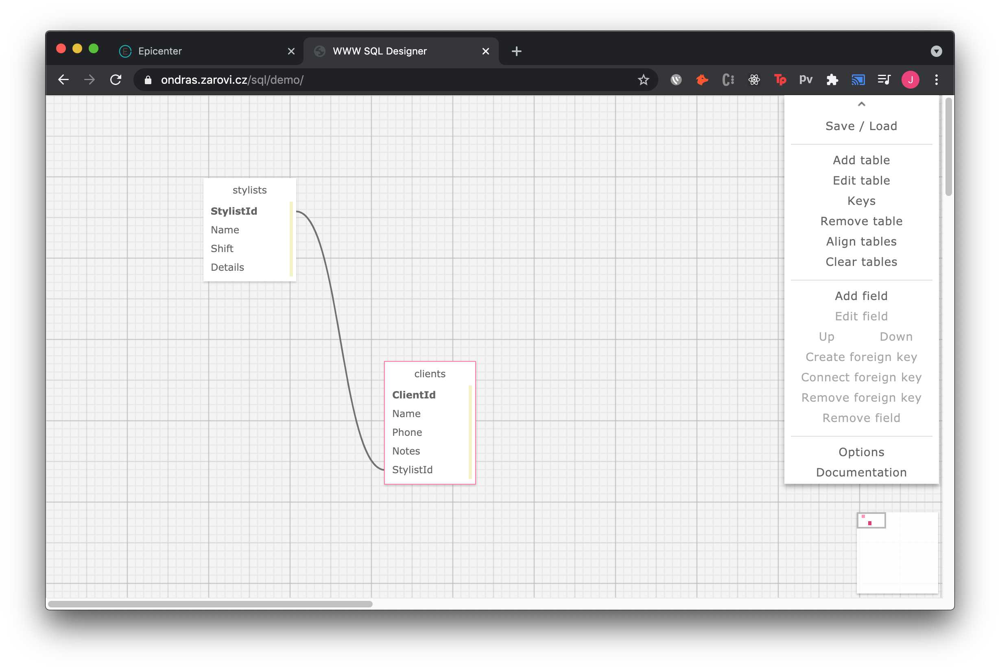

# Jesse's Eau Claire's Salon
https://github.com/jessecallahan/HairSalon.Solution

Created 05.21.21 
By _**Jesse Callahan**_ 
Contact: _**Jessetylercallahan@gmail.com**_ 

## Description
Eau Clarie's Salon is a C# application in the .NET MVC Framework that utilizes a local sql database. This application simulates a Salon database, where an owner can see all the Stylists and Clients they have booked using a one to many database relationship. 

## Setup/Installation Requirements

1. Clone this [repository](https://github.com/jessecallahan/HairSalon.Solution)
2. From the project directory folder (HairSalon) create a 'appsettings.json' file 
3. First, Copy this into the appsettings.json file:   `{
    "ConnectionStrings": {
        "DefaultConnection": "Server=localhost;Port=3306;database=jesse_callahan;uid=root;pwd=[YOUR-PASSWORD-HERE];"
    }
}`   *[YOUR-PASSWORD-HERE] is your sql password*
4. Now, Import Data into SQL Workbench (Download SQL WorkBench if you don't already have it) by:
+ In the Navigator > Administration window, select Data Import/Restore.
+ In Import Options select Import from Self-Contained File.
+ Navigate to the jesse_callahan.sql file.
+ Under Default Schema to be Imported To, select the New button.
+ Enter the name of this database which is: jesse_callahan
+ Click Ok.
+ Click Start Import.
+ Reopen the Navigator > Schemas tab. Right click and select Refresh All. Our new test database will appear.
5. Lastly, from the project directory folder use command 'dotnet restore' in your terminal to load boilerplate
7. From the project directory folder use command 'dotnet run' in your terminal to run server
8. Copy the local host 5000 server link into your perferred web browser
9. Enjoy!

## Specs
BELOW IS A SCHEMA CHART

## Technologies Used
* C#
* MySql
* Entity Framework
* .NET
* MVC
* CSS/HTML

